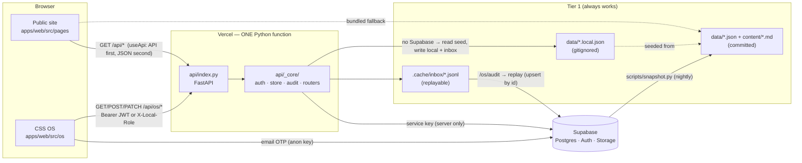

# ARCHITECTURE.md — one page

## The four layers

1. **Public site** — React pages. Every data read goes through
   `lib/useApi(path, fallback)`: it starts from the bundled JSON and swaps to
   the API payload when it arrives. Same shape both sides, so the page code
   never branches on where the data came from.
2. **The one function** — `api/index.py` only assembles routers.
   `api/_core/` is the app: `store.Collection` is the single read/write path
   (Supabase REST when configured, else local tables), `auth` turns a Supabase
   JWT into `guest | officer | admin` via the roster, `audit` writes one record
   per write, `crud.make_router` gives each table list/get/create/patch/delete/
   transition, and each `routers/*.py` adds the module's own actions.
3. **Tier 1** — with no env vars the API serves `data/*.json`, and OS writes
   go to `data/<table>.local.json` (gitignored) plus an append-only inbox line
   with a `client_id`. The OS is fully usable offline; nothing is ever dropped.
4. **Supabase** — Postgres tables (migrations in `supabase/`), email-OTP Auth,
   the `public-media` bucket. The browser holds only the anon key; the service
   key lives in Vercel's env and never leaves the function.

## The loops that keep it alive
- **Snapshot** (`scripts/snapshot.py`, nightly workflow): DB → committed JSON +
  markdown. Keeps Tier 1 current; also the restore path (`--restore`).
- **Keepalive** (every 3 days): pings `/api/health` so the free Supabase
  project never pauses; records `qa/keepalive.json`.
- **Post-deploy smoke**: the live `/api/health` must report the pushed SHA.
- **Audit**: every OS write → `records` (who, action, table, before/after).
  `/os/audit` shows the diff; `/os/inheritance` shows whether it's all working.

## Roles
`guest` sees only `/os/login`. `officer` = an `active` row on `board_profiles`
for the current term (any email not on the roster is a guest, whatever it
is). `admin` = `os_role: admin` (president + webmaster): roles, rollover,
settings, replay. In Tier 1 the local picker sets the role via a header the
API only honours off Vercel.

## Boundaries (the architecture review — adapted from quay/architecture-review)
What may import what, checked by the tools rather than by a reviewer:
- `apps/web/src/pages/**` and `os/**` read data only through `lib/useApi` (public) or
  `os/ui/useOs` (OS). No page fetches (`grep -rn "fetch(" apps/web/src/pages` is empty).
- Components read colour and copy from `tokens.css` + `brand/brand.config.ts`, never
  literals (`qa-scripts/tokens_gate.mjs`).
- `api/_core/routers/*` talk to storage only through `collections.Collection` and to
  the spine only through `spine.py`; the validator lives once, in `spine.py`.
- `api/index.py` is the only file Vercel turns into a function (`scripts/check_api_count.py`).
- Secrets exist only as env names in `scripts/env_validate.py` and at API startup.
Drift shows up as a red `make check`, not as a meeting.
