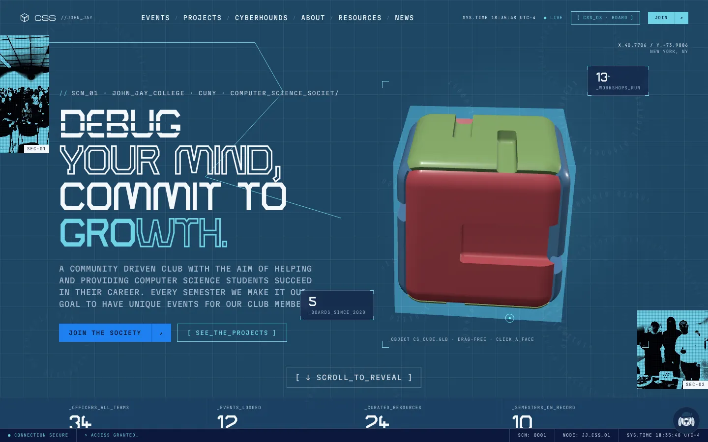
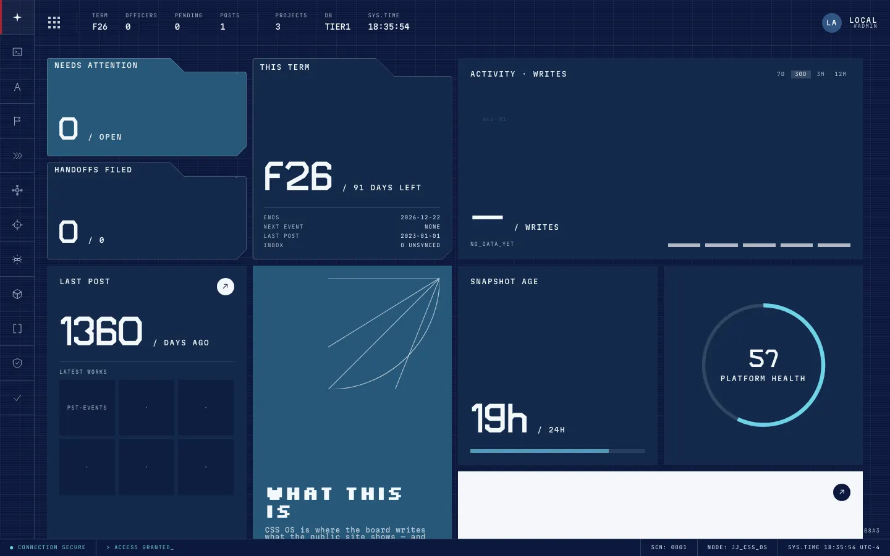

# jjay_css — John Jay Computer Science Society: site + board platform

The public website and the board's internal platform ("CSS OS") for the Computer Science Society at John Jay
College (CUNY) — one React app, one Python function, and a mode where all of it runs from committed files with
zero accounts.

[](https://github.com/ryanjdorestal/css_club_website/actions/workflows/ci.yml)
[](https://github.com/ryanjdorestal/css_club_website/actions/workflows/a11y.yml)


| The site (`/`)                   | The board platform (`/os`)         |
| -------------------------------- | ---------------------------------- |
|  |  |

## What this is

The **site** tells a John Jay student what the club is, when it meets, what it has built and how to join, and
it renders entirely from `data/*.json` and `content/**/*.md` in this repo. **CSS OS** lets the board run the
club without a developer: publish news, events and workshops, review project submissions, keep the resources
page true, import members, add each term's officers, and write down what the next board needs to know
(inheritance). One free Supabase project adds the database and the email-code login; one free Vercel project
hosts it; if either is down the site keeps serving the committed files. Everything is proved by checks you can
run on a laptop.

## Run it in 10 minutes

Needs Node 22+ and Python 3.12+ (`.nvmrc`, `.python-version`). **You need no accounts for this.**

```bash
git clone https://github.com/ryanjdorestal/css_club_website.git jjay_css && cd jjay_css
make install        # npm deps + a Python venv                     (~3 min)
make dev            # the site + the API, together
```

- http://localhost:5173/ — the site, reading `data/*.json` through the API.
- http://localhost:5173/os — the board platform. Pick **admin** in the LOCAL_DEV strip under the login form
  (that strip does not exist on Vercel).
- `make check` — lint, types, tests, guards: what CI runs. Green means green.

Try it: publish a post on `/os/posts` → it appears on `/news`, and `/os/audit` shows who did it. Change
`primary` in `data/site_settings.json` → reload `/`.

## Repo map

```
apps/web/          React 19 + TypeScript + Vite (Tailwind v4, Motion, React Three Fiber)
  src/pages/       one file per public route; pages/home/ holds Home's sections
  src/os/          CSS OS: one file per module, ui/ (shared tables, forms, toasts, the dashboard), system/
  src/components/  cards/, frame/, type/ + Nav, Footer, PageHero…
  src/cube/ mascot/ sigils/ textures/ motion/ lib/   the 3D cube, the hound, marks, backgrounds, helpers
  src/fonts/       the self-hosted faces (no CDN) — FONTS.md says which is which
api/index.py       the ONE Vercel function; api/_core/ is the app (store · auth · audit · crud · routers/ · tests/)
data/ content/     what the site shows: committed JSON + markdown; content/inheritance/ is the board's spine
supabase/          migrations 0001–0005 — the only way the schema changes
scripts/           snapshot, keepalive, db_budget, validators, the semester simulation, the break pass
brand/ assets/     brand.config.ts (names, palette, links) + logos, cube, hound sources
docs/              handoff/ (start there), RUNBOOK, OWNERSHIP, TERM_CHECKLIST, HOSTING_LIMITS, ENVIRONMENT,
                   CODE_STANDARDS, DECISIONS, LATER; archive/ = every run's prompt and log
qa/                REPORT_*.md per build run
```

## How to contribute

The whole loop, for someone who has used git once:

```bash
# 1. Fork on GitHub (the Fork button), then clone YOUR fork
git clone https://github.com/<you>/css_club_website.git jjay_css && cd jjay_css
git remote add upstream https://github.com/ryanjdorestal/css_club_website.git   # so you can pull updates later

# 2. Make a branch for the one thing you are changing
git checkout -b fix/events-empty-state        # feat/…, fix/…, docs/…, content/…

# 3. Change things, run it, check it
make dev                                       # look at what you changed in the browser
make check                                     # the same checks CI runs; fix what it says

# 4. Commit in conventional form and push to your fork
git add -A
git commit -m "fix(os): events empty state links to + NEW EVENT"
git push -u origin fix/events-empty-state

# 5. Open the pull request (GitHub shows a button after the push). Fill the template:
#    what changed · why · how you verified it · which gate covers it · docs updated?
```

What each step does: the fork is your copy on GitHub; the branch keeps your change separate from `main`;
`make check` runs lint, types, tests and the guards so the reviewer never sees a red CI; the conventional
commit message (`type(scope): what`) is linted; the pull request is where the review happens and where CI runs
`make check`, the build, the accessibility pass and the functional pass (a board member's day, end to end).
`main` is protected: every change goes through a PR with a green `check`.

**Your first contribution:** open the issues labelled
[good first issue](https://github.com/ryanjdorestal/css_club_website/labels/good%20first%20issue) — each names
the file to open, what "done" looks like, and the command that proves it. Then read `CONTRIBUTING.md` (one worked
example per kind of change) and `docs/CODE_STANDARDS.md` (what review checks). Board members who want a
content change rather than code: open a **Content** issue; no git needed.

## Where the docs are

| You want to…                                              | Read                                                                                          |
| --------------------------------------------------------- | --------------------------------------------------------------------------------------------- |
| take over as maintainer                                   | `docs/handoff/00_START_HERE.md` (10 numbered files + a first week)                            |
| understand the shape in one page                          | `ARCHITECTURE.md`                                                                             |
| add a page, a field, an endpoint, an OS module, an entity | `CONTRIBUTING.md`                                                                             |
| write code that passes review                             | `docs/CODE_STANDARDS.md`, `DESIGN.md` (the look — non-negotiable)                             |
| go live: accounts, env vars, domain                       | `SETUP.md` → `docs/handoff/04_SUPABASE_SETUP.md`, `05_VERCEL_SETUP.md`, `docs/ENVIRONMENT.md` |
| run the club with the OS, each term                       | `docs/HANDOFF.md`, `docs/TERM_CHECKLIST.md`, `docs/OWNERSHIP.md`                              |
| fix a red chip on `/os/system`                            | `docs/RUNBOOK.md`                                                                             |
| know why it will never hit a free-tier limit              | `docs/HOSTING_LIMITS.md`                                                                      |
| see why it was built this way                             | `docs/DECISIONS.md`; the planning history in `docs/archive/`                                  |

## The gates (what green means)

`make check` is CI: ruff · prettier · stylelint · markdownlint · oxlint · mypy --strict · tsc · pytest ·
vitest · route/image/token/repo audits · env names · `docs/API.md` current · the one-function guard · data +
inheritance validators · migration and asset policy · function length · banned names · dead code · duplication
(jscpd) · ts-prune · depcheck. With `make dev` running: `make a11y`
(pa11y + axe, 0 findings), `make smoke` (the OS gate + a board member's day), `make sim` (a whole semester from
an empty store, 25 steps), `make break` (16 ways to break it that do not work). Every tool and what it found:
`docs/SKILLS_ADOPTED.md`. Pushing: `docs/RELEASE.md`.

## Rules that keep it working

- `api/` holds exactly `index.py` + `requirements.txt` + `_core/`. A second file is a second Vercel function
  and a silent stale deploy. CI checks.
- Every API read has a JSON fallback; every OS write has a local inbox. The public site never depends on
  Supabase being up.
- No API keys for features. No LLMs. No credential in the repo, ever (`gitleaks` on every push).
- Palette, type and voice: `DESIGN.md`. One accent per section. Tokens, never literals.

## Who to ask

computersocjjay@gmail.com · the club Discord (the invite is on `/join`) · issues and discussions on this repo.
Built by Ryan Dorestal (2026) and handed to the board; Ryan answers questions for the first year.

## License and attribution

MIT — `LICENSE`. Text, images and structure carried over from the club's previous site are MIT too:
`jjcss/CSS_Website@a8fca55`, © 2022 Computer Science Society Club at John Jay College; the notice and every
source are listed in `SOURCES.md`. The John Jay wordmark and Bloodhound are the college's marks (see `SOURCES.md` for
where each came from).
